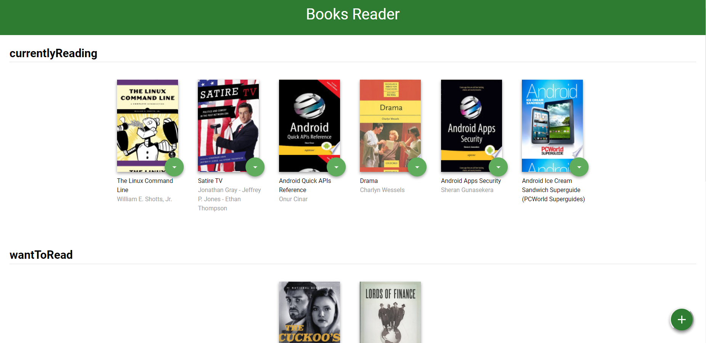
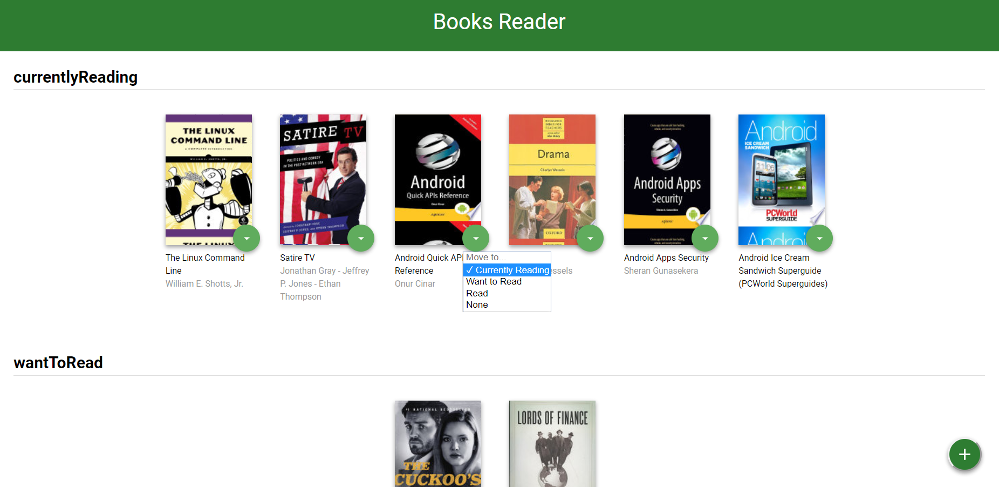
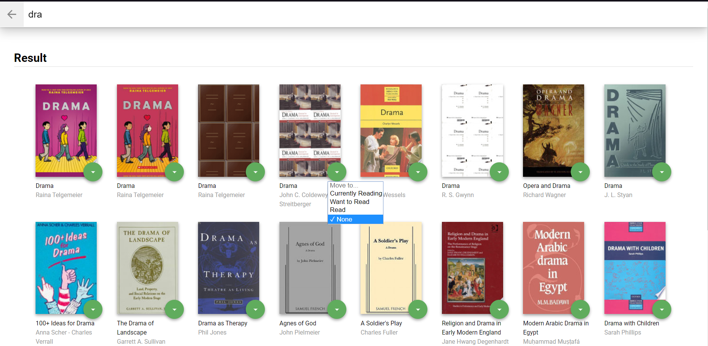

# Book Reader Project
A React JS Project for Udacity React Development Nano-degree

* Run `npm install`
* Then `npm start`
* You can access your library and search for books and add them to your library

